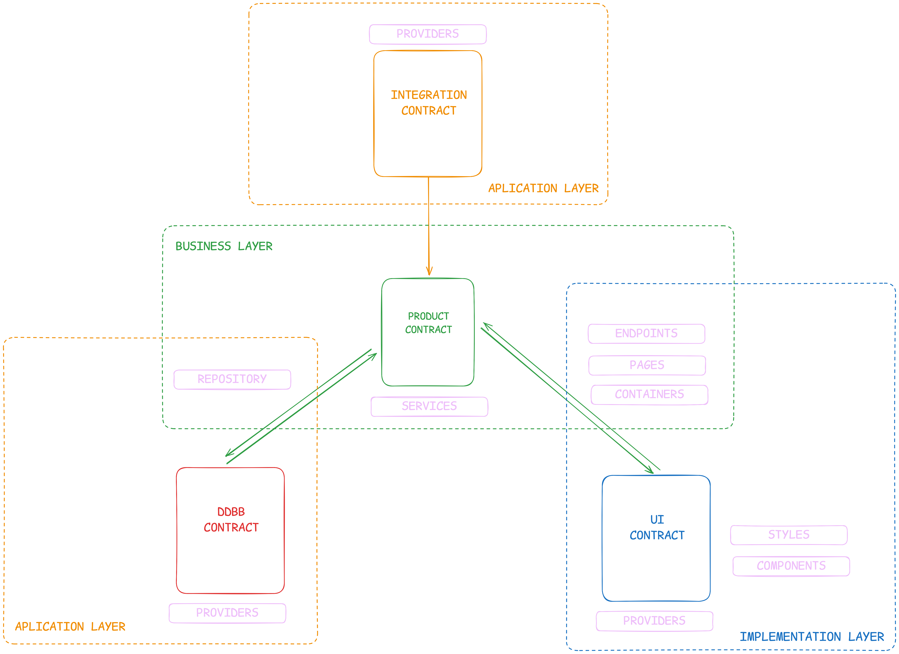

# Beyond Clean Architecture: A Pragmatic Software Model for Real-World Scalability

## **📌 Why This Model Exists (A Pragmatic Perspective)**  

Most software architecture discussions happen in an **idealized bubble** where teams are expected to have **endless time, unlimited resources, and highly specialized engineers**. But in reality, most companies operate under **three very different scenarios**:  

1️⃣ **Consultancies** → Where projects need to be delivered at breakneck speed, like a software assembly line.  
2️⃣ **Startups** → Where **business pivoting happens aggressively**, and the architecture must keep up.  
3️⃣ **Mature Products** → Where stability and maintainability are **more important than over-engineered abstractions**.  

Having worked across all these environments—**consultancies, fast-scaling startups, and long-term product maintenance**—I’ve seen **firsthand how most architectures fail**.  

- **Too simple?** → Becomes an unscalable mess as the product grows.  
- **Too complex?** → Creates unnecessary friction and becomes a bottleneck for teams.  
- **Hard to learn?** → Slows down onboarding, making hiring and scaling teams a nightmare.  

💡 **This model was born out of necessity**—a balance between **clarity, scalability, and ease of adoption**. It’s designed to work **in real-world companies with real-world challenges**, ensuring that both **junior and senior developers** can understand, implement, and scale it efficiently.  

---

## **📌 Introduction**

Modern software architecture usually falls into one of two extremes:

1️⃣ The “just wing it” approach (e.g., MVC, layered architecture) — works fine for a while… until your codebase starts looking like a Jenga tower held together by hope and duct tape.

2️⃣ The “overengineer everything” philosophy (e.g., Clean Architecture, DDD, Hexagonal Architecture) — great in theory, until you realize you need a PhD just to add a simple feature.

While these models offer valuable insights, they often fail in real-world applications because they are either too loose or too rigid. DDD, for example, is software-driven rather than business-driven, meaning that it often leads to beautifully structured systems… that completely ignore what the business actually needs.

😓 The real problem? Most architectures focus so much on being “technically correct” that they forget about being practically useful.

🚀 This article introduces a pragmatic software model that finds the sweet spot between order and flexibility, making sure your code doesn’t collapse under its own weight or require a 300-page manual to understand.

---

💭 “Ever spent hours debating where to put a file in your codebase, only to end up throwing it into utils/ like a lost sock? Yeah, we’ve all been there.”

---

## 📌 **Key Features of This Architecture Model**

### ** 1. Path Context - Self-Explanatory File Structure**

🔹 **Removes redundant file names** – The directory path itself provides the necessary context.  
🔹 **Enhances scalability** – New files can be added within a structured hierarchy without clutter.  
🔹 **Improves navigation** – Developers can instantly understand a file's purpose just by looking at its path.  

### ** 2. Scope - Understanding the Impact of Changes**

🔹 **Defines the influence of each file on the system** – Knowing whether an issue is isolated or critical saves debugging time.  
🔹 **Prevents unintended side effects** – Ensures that modifications don’t break the entire application.  
🔹 **Encourages maintainability** – Clear separation of responsibilities reduces complexity.  

### ** 3. Horizontal Code Scalability**

🔹 **Encourages feature expansion without excessive refactoring** – New logic is introduced as additional files instead of modifying existing ones.  
🔹 **Eliminates deep file nesting** – Keeps the structure flat and readable, reducing unnecessary layers of abstraction.  
🔹 **Ensures a consistent approach to growth** – Scaling is based on new entities and functionalities, not arbitrary complexity.  

### ** 4. Developer-Friendly Design - Lower Cognitive Load**

🔹 **Removes decision fatigue** – Developers always know where a new feature belongs.  
🔹 **Boosts autonomy** – Junior and senior devs alike can contribute without overthinking structure.  
🔹 **Faster onboarding** – New developers can grasp the structure quickly, reducing ramp-up time.  

### ** 5. Debugging & Maintainability Advantages**

🔹 **Minimizes search time** – Scope awareness helps pinpoint issues faster.  
🔹 **Reduces spaghetti code** – Code is naturally modular, making debugging simpler.  
🔹 **Enforces structured decision-making** – Path Context & Scope work together to ensure clear separations.  

---

## **📌 Core Foundations: The Three Logical Layers**  

Every business-driven software system must balance **three fundamental logical layers**, each tightly coupled to the company’s needs:  

🔹 **Product/Business Logic** → Defines how the product behaves. This logic is **exclusive to the company** and is what differentiates one business from another.  
🔹 **Implementation Logic** → Defines how the product is built. It describes the **type of product** (e.g., a web application, an API, a mobile app).  
🔹 **Application Logic** → Defines how external technologies integrate into the product. It **connects third-party tools, libraries, and services** to the system.  

These conceptual layers **translate into tangible project layers**, which dictate how the project structure should be organized.  

## 📌  **Interfaces/Contract in the Architecture Model**

### ** The Role of Interfaces**

Interfaces serve as **contracts** between different layers of the architecture. They ensure that each layer interacts only with well-defined structures, preventing unintended dependencies and making the system **more scalable and maintainable**.  

This model introduces **three key interface types:**

1️⃣ **Product Interface** → Defines how business logic exposes data.  
2️⃣ **Data Interface** → Defines how repositories handle storage and retrieval of data.  
3️⃣ **UI Interface** → Defines how frontend components communicate with business logic.  

While these interfaces are distinct in their responsibilities, **they can sometimes overlap depending on the complexity of the project**. In smaller applications, the product and data interfaces may closely resemble each other, while in more complex systems, maintaining strict separation is essential for long-term scalability.

### ** 1. Product Interface (Business Logic Layer → External Systems & UI)**

♻️ **Purpose:** Ensures that business logic is exposed in a controlled and structured way.  
🚩**Why is this important?**
- Prevents leaking **internal business logic** outside the service layer.
- Ensures that API responses match product needs rather than raw database structures.
- Decouples storage concerns from application logic.

### ** 2. Data Interface (Repositories → Business Logic Layer)**

♻️ **Purpose:** Translates raw storage structures (DB, cache, files) into a usable format for the business logic.  
🚩**Why is this important?**
- Ensures that **storage logic is abstracted** from the business layer.
- Allows future changes in the database structure without affecting services.
- Encourages **clean separation** of concerns.

### ** 3. UI Interface (Frontend Components → Business Logic Layer)**

♻️ **Purpose:** Translates product data into a **UI-friendly** format for components.  
🚩**Why is this important?**
- Keeps UI logic **separated from business logic**.
- Ensures frontend components **only deal with presentation logic**.
- Allows easier changes to UI structure without modifying core logic.

### ** How These Interfaces Work Together**

These three interface types ensure that each architectural layer remains **cleanly separated**, but their level of independence depends on the **scalability needs of the project**. In **small projects**, these interfaces may be closely intertwined, while in **larger systems**, enforcing a strict separation is crucial for preventing technical debt.

1️⃣ **Repositories → Data Interface → Business Logic Layer**  
2️⃣ **Business Logic → Product Interface → External Systems & UI**  
3️⃣ **UI Components → UI Interface → Business Logic Layer**  

#### **Key Scalability Insight:** 

- **Clear separation** of interfaces ensures the system can scale efficiently without creating unnecessary dependencies.
- **Modularity and autonomy** in these interfaces help in managing complex projects and reducing the cost of future refactors.
- **A well-structured interface model is what enables long-term maintainability and adaptability as business needs evolve.**

💡 **By enforcing structured interfaces appropriately based on project complexity, this model ensures clear separation of concerns while maintaining flexibility and scalability.** 🚀

#### **Project Structure Example (Next.js + Persistence + Distributed Cache)**  

For a **Next.js** project that requires **a persistence layer and distributed caching**, the structure inside `/src` (or the project root) could be as follows:  

##### **📂 `pages/` (Implementation + Business Logic)**  
📈 **Description:** This belongs to the **implementation layer** but also contains **business logic**.  
💭 **Why?** → It is **tightly coupled to Next.js**, defining how the application structures UI data based on its routing system.  

##### **📂 `containers/` (Implementation + Business Logic)**  
📈 **Description:** This belongs to the **implementation layer** but integrates **business logic**.  
💭 **Why?** → It **renders UI components** (React) but also **handles UI behavior**, such as **form validation, CTAs (calls to action), and interaction flows.**  

##### **📂 `components/` (Purely Implementation Layer - UI Focused)**  
📈 **Description:** **100% presentational,** responsible for rendering HTML elements or integrating external UI libraries.  
💭 **Why?** → It **knows nothing about the business** and can be **ported to another project using the same stack** without modifications.  

##### **📂 `providers/` (Purely Application Layer - External Integrations)**  
📈 **Description:** **Direct connectors** with external libraries, APIs, or third-party services.  
💭 **Why?** → A `provider/cache.ts` could **manage Redis integration** but would never contain business-specific logic.  

##### **📂 `services/` (Purely Business Layer - The Brain of the Application)**  
📈 **Description:** The **core logic layer** responsible for structuring and processing business data.  
💭 **Why?** → Services dictate **how company-specific data is transformed, manipulated, and exposed.**  

##### **📂 `repositories/` (Business Layer + Engineering Optimization)**  
📈 **Description:** Responsible for handling **persistence and storage interactions** (databases, caches, etc.).  
💭 **Why?** → Unlike services, repositories **define the engineering-level optimizations of data storage and retrieval.**  

---

## 📌 **Advantages of This Architecture Model Over Existing Approaches**

### ** 1. Business-Driven vs. Software-Driven Architectures**

🔹 **Traditional Models:** Many architectures prioritize technical purity over business needs, leading to rigid structures that don’t adapt well to business changes. **DDD**, for example, focuses heavily on domain modeling but can create unnecessary complexity when rapid iteration is required.

🔹 **This Model:** Ensures that software aligns with business growth, pivoting, and evolving requirements. It strikes a balance between maintaining structured logic and adapting quickly when business needs shift.

✅ **Advantage:** A structure that scales with the business rather than against it.

### ** 2. Simplicity & Scalability Compared to Existing Models**

🔹 **Traditional Models:**
- **MVC / Layered Architecture** → Simple, but scales poorly in complex applications.
- **Clean Architecture / Hexagonal Architecture** → Well-structured, but often introduces unnecessary abstractions that slow down development.

🔹 **This Model:** Finds the **sweet spot between clarity and scalability**, ensuring that developers don’t have to choose between maintainability and efficiency.

✅ **Advantage:** Ensures projects don’t collapse under their own weight while staying intuitive for developers.

### ** 3. Path Context vs. Deep Nesting in Other Models**

🔹 **Traditional Models:**
- Some architectures **force deep nesting** (e.g., Clean Architecture with multiple indirections), making navigation difficult.
- Others rely on **inconsistent file organization**, leading to debates over where each file should go.

🔹 **This Model:** Introduces **Path Context**, making the directory structure **self-explanatory and scalable**. Instead of redundant naming conventions and unnecessary folders, it organizes code in a way that reflects the actual application structure.

✅ **Advantage:** Faster onboarding, reduced cognitive load, and improved maintainability.

### ** 4. Scope Awareness vs. Undefined Change Impact**

🔹 **Traditional Models:** Often lack clear guidance on **how much impact** a code change will have. This makes debugging unpredictable and large-scale refactors risky.

🔹 **This Model:** Introduces **Scope Awareness**, categorizing files based on their system-wide impact.

✅ **Advantage:** Debugging is faster, and refactors are done with **clear expectations of their consequences**.

### ** 5. Horizontal Scalability vs. Vertical Overcomplication**

🔹 **Traditional Models:**
- Force developers to **constantly modify existing files**, leading to bottlenecks in scaling.
- Introduce **deeply nested dependencies**, which create complexity over time.

🔹 **This Model:** Encourages **horizontal scalability**, allowing teams to add new features as separate files rather than modifying tightly coupled existing ones.

✅ **Advantage:** Expanding the codebase remains **clean and manageable**.

### **6. Reduced Developer Cognitive Load vs. Decision Fatigue**

🔹 **Traditional Models:** Require developers to make too many structural decisions before implementing features, leading to decision fatigue.

🔹 **This Model:** Defines clear, easy-to-follow rules that allow developers to **focus on building features rather than debating structure**.

✅ **Advantage:** Faster implementation and improved developer productivity.

### **7. Adaptability vs. One-Size-Fits-All Architectures**

🔹 **Traditional Models:**
- **Clean Architecture & Hexagonal** → Great for long-term maintainability but too rigid for rapid prototyping.
- **Layered / Monolithic Approaches** → Simple to implement but difficult to scale without massive refactors.

🔹 **This Model:** Provides a **flexible, modular approach** that adapts to different types of projects—whether it's a **fast-moving startup, a consultancy delivering multiple projects, or an enterprise product needing long-term maintainability**.

✅ **Advantage:** A single model that suits **fast-moving startups, agency-style consultancies, and enterprise software alike**.

🔥 **This model removes unnecessary complexity while maintaining the flexibility and structure required for long-term success.** 🚀

---

## 📌 **Conclusion: Why This Model Works in the Real World**

Modern software development requires an architecture that is **structured yet adaptable**, scalable but not over-engineered. **This model was built from real-world experience, bridging the gap between rigid methodologies and chaotic, unstructured projects.**

#### ** Key Takeaways**

✅ **Business-driven, not just software-driven** → Ensures architecture aligns with real company needs, whether it's a fast-moving startup or a long-term enterprise product.  
✅ **Path Context & Scope Awareness** → Makes the project easy to navigate and debug while reducing redundancy.  
✅ **Scalability without complexity** → Supports both rapid prototyping and long-term maintainability without unnecessary abstraction.  
✅ **Developer-friendly & easy to adopt** → Reduces cognitive load, decision fatigue, and onboarding time.  
✅ **Flexible across different project types** → Works for consultancies, startups, and established products alike.  

#### ** The Final Thought**

While no architecture is perfect, **this model strikes a balance** between clarity, flexibility, and maintainability. It embraces **best practices without dogmatic complexity**, making it an excellent choice for teams that need to scale efficiently while keeping their codebase understandable.

💡 **The goal is simple:** to make software development **faster, cleaner, and more aligned with business needs.**

🔗 **Want to contribute? Share your feedback and let’s refine it together!** 🚀

---

## 📌 **Real examples**

- Portfolio (nextjs + mongodb + redis + openai): 🔗[link](https://github.com/adrihle/portfolio)
