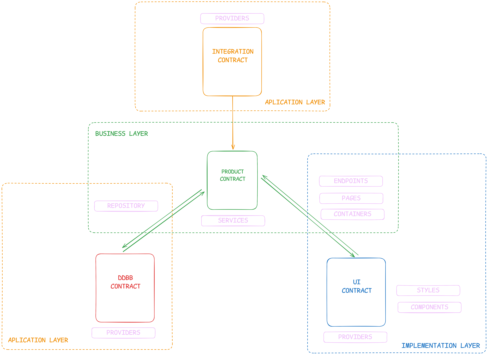

# Beyond Clean Architecture: A Pragmatic Software Model for Real-World Scalability

## **📌 Why This Model Exists (A Pragmatic Perspective)**

Most software architecture discussions happen in an **idealized bubble** where teams are expected to have **endless time, unlimited resources, and highly specialized engineers**. But in reality, most companies operate under **three very different scenarios**:

1️⃣ **Consultancies** → Where projects need to be delivered at breakneck speed, like a software assembly line.  
2️⃣ **Startups** → Where **business pivoting happens aggressively**, and the architecture must keep up.  
3️⃣ **Mature Products** → Where stability and maintainability are **more important than over-engineered abstractions**.  

Having worked across all these environments—**consultancies, fast-scaling startups, and long-term product maintenance**—I’ve seen **firsthand how most architectures fail**.  

- **Too simple?** → Becomes an unscalable mess as the product grows.  
- **Too complex?** → Creates unnecessary friction and becomes a bottleneck for teams.  
- **Hard to learn?** → Slows down onboarding, making hiring and scaling teams a nightmare.  

💡 **This model was born out of necessity**—a balance between **clarity, scalability, and ease of adoption**. It’s designed to work **in real-world companies with real-world challenges**, ensuring that both **junior and senior developers** can understand, implement, and scale it efficiently.

---

## **🔥 Introduction**

Modern software architecture usually falls into one of two extremes:

- **The “just wing it” approach** (e.g., MVC, layered architecture) — works fine for a while… until your codebase starts looking like a Jenga tower held together by hope and duct tape.
- **The “overengineer everything” philosophy** (e.g., Clean Architecture, DDD, Hexagonal Architecture) — great in theory, until you realize you need a PhD just to add a simple feature.

While these models offer valuable insights, they often fail in real-world applications because they are either too loose or too rigid. **DDD, for example, is software-driven rather than business-driven**, meaning that it often leads to beautifully structured systems… that completely ignore what the business actually needs.

📌 The real problem? Most architectures focus so much on being “technically correct” that they forget about being practically useful.

🚀 This article introduces a **pragmatic software model** that finds the sweet spot between order and flexibility, making sure your code doesn’t collapse under its own weight or require a 300-page manual to understand.

---

💭 *“Ever spent hours debating where to put a file in your codebase, only to end up throwing it into `utils/` like a lost sock? Yeah, we’ve all been there.”*

---

## **🚀 Core Features of This Architecture Model**

### **1. Path Context - Self-Explanatory File Structure**
- Removes redundant file names – The directory path itself provides the necessary context.  
- Enhances scalability – New files can be added within a structured hierarchy without clutter.  
- Improves navigation – Developers can instantly understand a file's purpose just by looking at its path.  

### **2. Scope - Understanding the Impact of Changes**
- Defines the influence of each file on the system – Knowing whether an issue is isolated or critical saves debugging time.  
- Prevents unintended side effects – Ensures that modifications don’t break the entire application.  
- Encourages maintainability – Clear separation of responsibilities reduces complexity.  

### **3. Horizontal Code Scalability**
- Encourages feature expansion without excessive refactoring.  
- Eliminates deep file nesting – Keeps the structure flat and readable, reducing unnecessary layers of abstraction.  
- Ensures a consistent approach to growth – Scaling is based on new entities and functionalities, not arbitrary complexity.  

### **4. Developer-Friendly Design - Lower Cognitive Load**
- Removes decision fatigue – Developers always know where a new feature belongs.  
- Boosts autonomy – Junior and senior devs alike can contribute without overthinking structure.  
- Faster onboarding – New developers can grasp the structure quickly, reducing ramp-up time.  

### **5. Debugging & Maintainability Advantages**
- Minimizes search time – Scope awareness helps pinpoint issues faster.  
- Reduces spaghetti code – Code is naturally modular, making debugging simpler.  
- Enforces structured decision-making – Path Context & Scope work together to ensure clear separations.  

---

## **📌 Core Foundations: The Three Logical Layers**  

  

Every business-driven software system must balance **three fundamental logical layers**, each tightly coupled to the company’s needs:  

🔹 **Product/Business Logic** → Defines how the product behaves. This logic is **exclusive to the company** and is what differentiates one business from another.  
🔹 **Implementation Logic** → Defines how the product is built. It describes the **type of product** (e.g., a web application, an API, a mobile app).  
🔹 **Application Logic** → Defines how external technologies integrate into the product. It **connects third-party tools, libraries, and services** to the system.  

These conceptual layers **translate into tangible project layers**, which dictate how the project structure should be organized.

---

## 🚀 **Conclusion: Why This Model Works in the Real World**

Modern software development requires an architecture that is **structured yet adaptable**, scalable but not over-engineered. **This model was built from real-world experience, bridging the gap between rigid methodologies and chaotic, unstructured projects.**

### **📌 Key Takeaways**

✅ **Business-driven, not just software-driven** → Ensures architecture aligns with real company needs, whether it's a fast-moving startup or a long-term enterprise product.  
✅ **Path Context & Scope Awareness** → Makes the project easy to navigate and debug while reducing redundancy.  
✅ **Scalability without complexity** → Supports both rapid prototyping and long-term maintainability without unnecessary abstraction.  
✅ **Developer-friendly & easy to adopt** → Reduces cognitive load, decision fatigue, and onboarding time.  
✅ **Flexible across different project types** → Works for consultancies, startups, and established products alike.  

### **🚀 The Final Thought**

While no architecture is perfect, **this model strikes a balance** between clarity, flexibility, and maintainability. It embraces **best practices without dogmatic complexity**, making it an excellent choice for teams that need to scale efficiently while keeping their codebase understandable.

💡 **The goal is simple:** to make software development **faster, cleaner, and more aligned with business needs.**

🔗 **Want to contribute? Share your feedback and let’s refine it together!** 🚀
